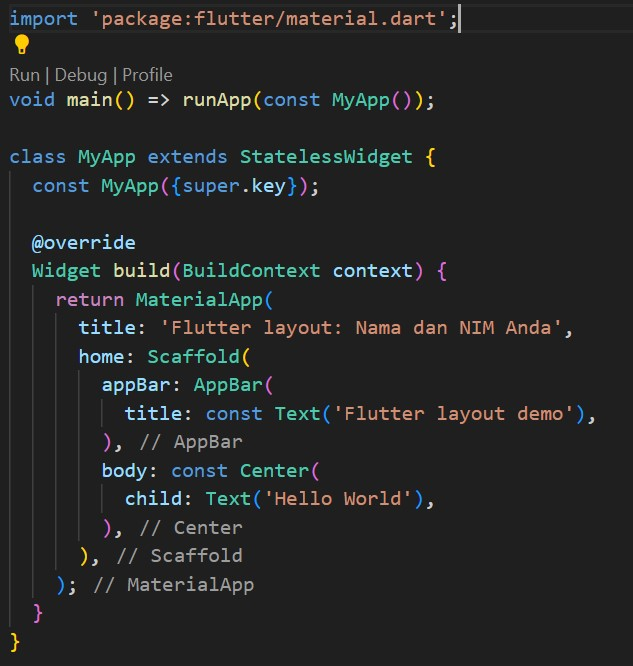
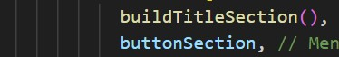

**Nama  : Fergie Fatah Ardiansyah  
  Kls   : TI-3G  
  NIM   : 2141720211   **

  *<u>Praktikum 1</u>  *
  *Langkah 1: Buat Project Baru  *
  *Langkah 2: Buka file lib/main.dart *
   
  *Langkah 3: Identifikasi layout diagram  *
  *Langkah 4: Implementasi title row *
   
   
  Output 
    
  *<u>Praktikum 2</u>  *
  *Langkah 1: Buat method column _buildButtonColumn *
   
  *Langkah 2: Buat Widget buttonSection *
   
  *Langkah 3: Tambah button section ke body *
   
  Output 
    
  *<u>Praktikum 3</u>  *
  *Langkah 1: Buat widget textSection *
   
  *Langkah 2: Tambahkan variable text section ke body *
   
  Output 
    
  *<u>Praktikum 4</u>  *
  *Langkah 1: Siapkan asset gambar *
   
  *Langkah 2: Tambahkan gambar ke body *
   
  *Langkah 3: Ubah menjadi ListView *
   
  Output   
